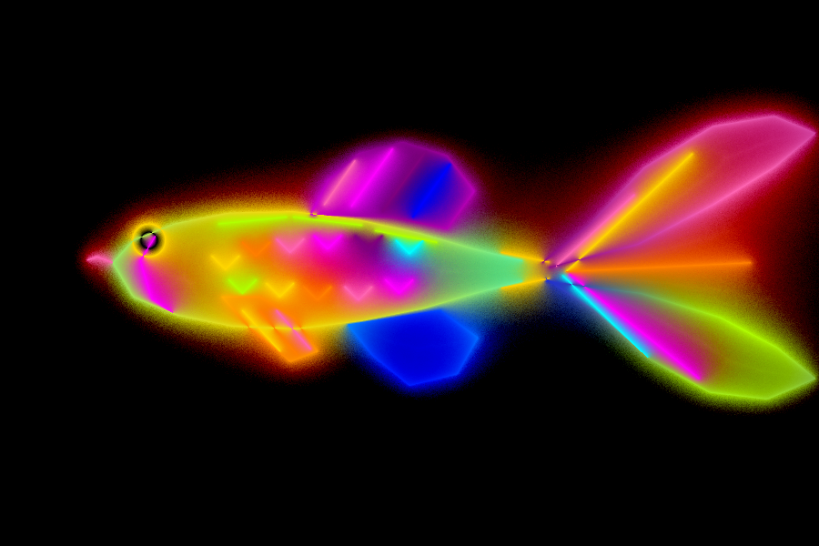
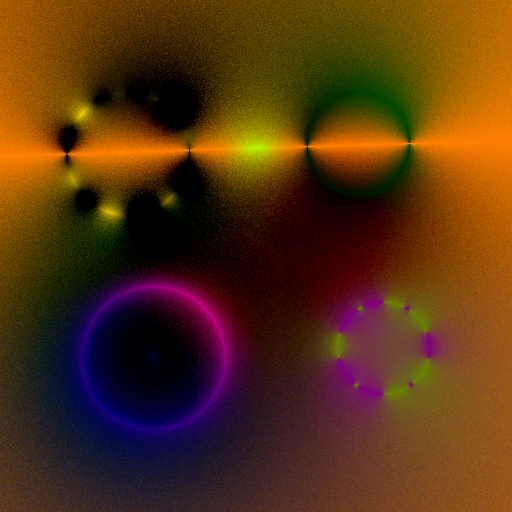
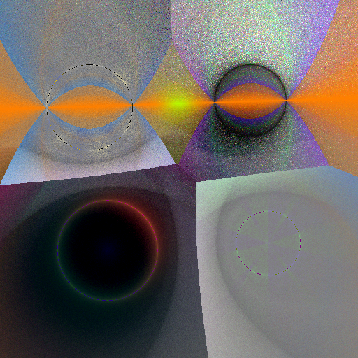
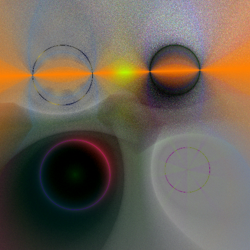

# mcguppy



## Theory

mcguppy is a non-physical Poisson equation solver. It is based on the research by [West & Mukherjee (2024)](http://cv.rexwe.st/pdf/srfoe.pdf) and [Sawhney & Crane (2020)](http://www.rohansawhney.io/mcgp.pdf).

The *rendering equation* 

$$L(\mathbf{x},\mathbf{y}) = L_e(\mathbf{x},\mathbf{y}) + \int_\mathcal{V} f_r(\mathbf{x},\mathbf{y},\mathbf{z}) G(\mathbf{y},\mathbf{z}) L(\mathbf{y},\mathbf{z}) d\mathbf{z}$$

is a single equation that models global illumination and reproduces photorealistic 3D imagery. 

In 2024, West and Mukherjee proposed a *stylized rendering equation* 

$$L(\mathbf{x},\mathbf{y}) = g_{\theta}\left(L_e(\mathbf{x},\mathbf{y}) + \int_\mathcal{V} f_r(\mathbf{x},\mathbf{y},\mathbf{z}) G(\mathbf{y},\mathbf{z}) L(\mathbf{y},\mathbf{z}) d\mathbf{z}\right)$$

where a *stylization function* $g_\theta$ alters the intensity of light recieved by and reflected from a point on a surface. It generalizes various methods for non-photorealistic rendering into one equation.

On the other hand, potential field of an electric charge, gravity, mass density, fluid pressure and stationary state heat conduction share something in common, which is that they can be modeled by Poisson's equation:

$$u(\mathbf{x}) = \frac{1}{|\partial B(\mathbf{x})|}\int_{\partial B(\mathbf{x})} u(\mathbf{y}) d\mathbf{y} - \int_{B(\mathbf{x})} f(\mathbf{y})G(\mathbf{x}, \mathbf{y}) d\mathbf{y}.$$

The Poisson equation bears some commonalities to the rendering equation in which they are both integral equations which reference themselves in the integrand. Therefore, they can be solved via recursive Monte Carlo methods. For the case of the Poisson equation, the algorithm used to solve it is "Walk on Spheres" (Sawhney and Crane, 2020).

The purpose of this repository is to inject *modifier functions* into the Poisson equation, similar to how stylization functions alter the rendering equation, to realize "stylized" solutions to the Poisson equation.

$$u(\mathbf{x}) = g_\theta\left(\frac{1}{|\partial B(\mathbf{x})|}\int_{\partial B(\mathbf{x})} u(\mathbf{y}) d\mathbf{y} - \int_{B(\mathbf{x})} f(\mathbf{y})G(\mathbf{x}, \mathbf{y}) d\mathbf{y}\right).$$

The same Walk on Spheres method is used to solve the modified Poisson equation.

This repository is a fork of the [mcfishy](https://github.com/Beeflats/mcfishy) repository whose README details the Walk on Spheres algorithm. We have opted for $u$ to be a color field in a 2D domain to accentuate the effects of modification functions.

## Results and Discussion
Figure 1: A Poisson solution with $g_\theta$ being the identity function.



Figure 2: A solution to the Poisson equation using modification functions using Walk on Spheres.



Without any modification to the original Poisson equation solver i.e. $g_\theta(c) = c$, the solutions (figure 1) look nearly harmonic except at solid boundaries. However, the solutions to the modified Poisson equation (figure 2) has some clear discontinuities within the domain. The discontinuities arise due to the nearest neighbor query of the Walk on Spheres algorithm, where the hard ridges on the color field define the midpoint of two solid boundaries. With no purposeful art-direction, iridescent and caustic patterns also arise.

Figure 3: A solution to the Poisson equation using modification functions using Antithetical Walk on Spheres.



To reduce the harsh discontinuities, the Antithetic Walk on Spheres algorithm, described by [Rioux-Lavoie et.al (2022)](https://riouxld.xyz/publication/2022-mcfluid/), was implemented. It is essentially the same algorithm as Walk On Spheres but the first sampled point comes with an antithetical point with negated displacement. The average color of the first sampled point and its antithesis make up the boundary contribution for the point of interest. The harsh discontinuities where two or more boundary elements coincide have been smoothed out. Discontinuities remain in the caustic patterns, albeit smoother, suggesting that caustics are an artifact of the Stylized Poisson Equation rather than a problem with sampling. An open question is 'how can or whether modification functions be defined to generate fractals?'.

A potential alteration to the Walk on Spheres algorithm is to replace the nearest neighbor query with $k$-nearest neighbors such that each solid boundary has a weighted contribution to the evaluation of the color field. Another potential change is to take antithetical steps on the second, third , etc. iterations of the Walk on Spheres algorithm. 

Other things to experiment with are to create modification functions for vector fields (and tensor fields) and observe the solver's effects on physical phenomena such as particle advection or shape deformation. Another is to implement and compare results against a modified Walk on Boundary or Walk on Stars solver. A 3D stylized Poisson solver would also be interesting to observe. These experiments will involve rewriting the current program.

## Implementation guide

### Create solid boundaries and define their boundary conditions, and style.
```
circle₁ = Circle(Point(-2.5,  2.0), 1.2)
bc₁(x) = MIXER_FAKE_NOISE(x, GOLD, 5)
modifier₁ = MODIFIER_identity

circle₂ = Circle(Point(2.5, -1.8), 0.9)
bc₂(x) = MIXER_CHECKER(x, PURPLE, OLIVE, 2)
modifier₂ = MODIFIER_clamp([0.2, 0.2, 0.2], [1.0, 8.0, 1.0]) ∘ MODIFIER_complement

C₁ = boundary₁(circle₁, bc₁, modifier=modifier₁)
C₂ = boundary₂(circle₂, bc₂, modifier=modifier₂)
```

Template color fields (`MIXER_`) and colors can be found in `BoundaryConditions.jl`. 

Template modifiers (`MODIFIER_`) can be found in `Modifier.jl`. Modifiers can sum and multiply with each other among other operations outlined in the same `Modifier.jl` file.

### Define a scene
Scenes are the union of boundary objects.
```
∂𝕊 = C₁ ∪ C₂
```

### Define forcing function
The same color field templates in `BoundaryConditions.jl` can be used to define sources and sinks.
```
A = Point(1.5, 1.0)
B = Point(-1.8, -1.5)
f(x::Point) = 0.5 * MIXER_GAUSSIAN_2D(x, TEAL, A, 1) + 0.5 * MIXER_GAUSSIAN_2D(x, MAGENTA, B, 1.5)
```

### Solve the Poisson problem and the modified Poisson problem
Define the parameters for the solver
```
WoS_depth = 30
num_Samples = 200
ϵ = 0.004
```

Define the color field whose solution solves the modified Poisson equation.
```
u(x::Point) = solvePoisson(x, ∂𝕊, f, WoS_depth, num_Samples, ϵ)
```

### Visualize the solution
A continuous rendering domain is to be discretized into a lattice
```
Ω = makeDomain(10.0, 10.0) # (x, y) ∈ [-5, 5] × [-5, 5]
resolution = (256, 256)
Nx, Ny = resolution
♯Ω = discretize(Ω, Nx, Ny)
```

Evaluate the values of the color field at every point in the discretized domain.
```
image_poisson_modified = u.(♯Ω.grid)
```

Display the colors of the color field in the defined domain.
```
viewImage(image_poisson_modified)
```
